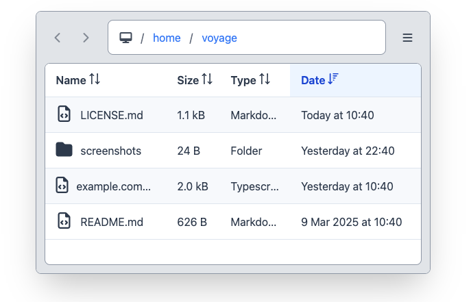

# ngx-voyage

[](https://www.npmjs.com/package/ngx-voyage)

`ngx-voyage` is a File Explorer component for [Angular](https://angular.dev/) and [PrimeNG](https://primeng.org/).\
Demo and docs: https://mschn.github.io/ngx-voyage/

<p align="center">
  
</p>

## Quickstart

Install `ngx-voyage` with `npm`:

```bash
npm install ngx-voyage
```

Use `<ngx-voyage>` in your app:

```ts
import { File, NgxVoyageComponent } from "ngx-voyage";

@Component({
  selector: "app-root",
  imports: [NgxVoyageComponent],
  template: '<ngx-voyage [path]="path()" [files]="files()"></ngx-voyage>',
})
export class AppComponent {
  path = signal("/home/");
  files = signal<File[]>([]);
}
```

## Built with

- [Angular](https://angular.dev/)
- [PrimeNG](https://primeng.org/)
- [Tailwind](https://tailwindcss.com/)
